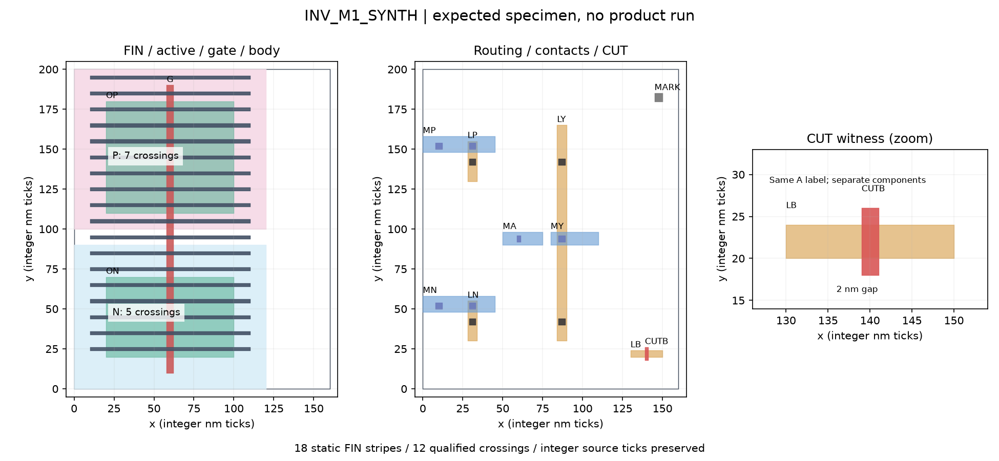

# W003 本地样本交付

先核对小单元的几何和连接，再检查文件链是否保真。`INV_M1_SYNTH` 的 source/target 都是 N=5、P=7；预期没有 ECO commit，但仍须检查全部 toy 规则并导出一致文件。

本目录是 [W003](../W003-m1-fixture-contracts.md) 的执行附件，产品合同仍以 [architecture](../../architecture.md) 为准。这里的 schema 和字段拼写为 `w003-example/1` 审查用样张，尚未经 PM 接收为产品 wire API。所有 run、snapshot、check、报告均是**预期样张，未执行产品 run**；辅助检查的实测结果另存执行证据。

图从手写 spec 绘制，仅辅助人读；正确性来自逐坐标/端子表与独立 reader，图不是另一个 oracle。右侧放大图显示 drawn LI 与 CUT overlay，CUT 去除的 2 nm 中段使 effective LI 分为两岛。

| 入口 | 用途 |
| --- | --- |
| [文件与记录合同](contracts.md) | M1 producer/consumer、exact encoding、必需字段、非法组合和失败流 |
| [记录样张](examples/records.json) | Evidence、attempt、baseline、snapshot、RunRecord、Manifest/check/report/terminal 的相互引用 |
| [失败样张](examples/failures.json) | pre-context、sealed、freeze、export/check/report/terminal 的代表组合 |
| [人读报告样张](examples/report.expected.md) | 工程 no_change 应如何披露结果和缺项 |
| [schema 字段表](examples/schema.json) | 样张专用 closed record 字段/variant；不是产品 parser |
| [后续实施与 PM 接收](handoff.md) | 要求覆盖、legacy 取用、真实缺项、首交错误路径和复查步骤 |
| [synthetic 输入](../../../tests/fixtures/w003_m1/) | 手写 spec/oracle、GDS/CDL、raw/header/normalized、toy tech/site/policy 和失败输入 |

样本内部可以使用明确声明的 toy 单位、模型和语法；这些选择不表示实际 Calibre dialect 或保密 PDK 已确认。生产回传权限、平台 build、离线依赖和真实验收回执仍交 PM 协调，不阻塞本地准备。
